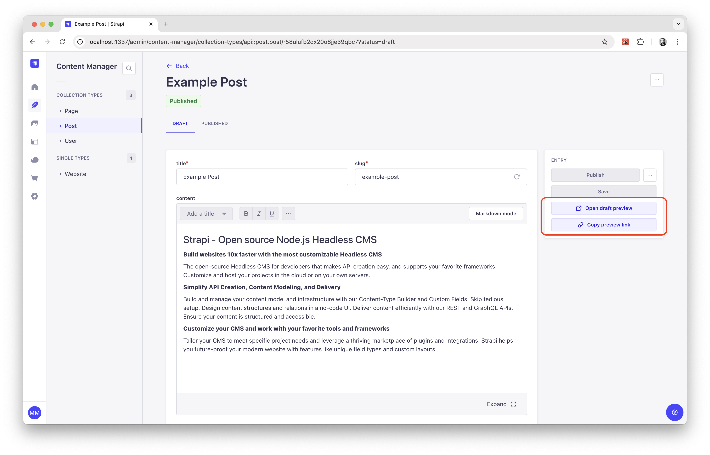
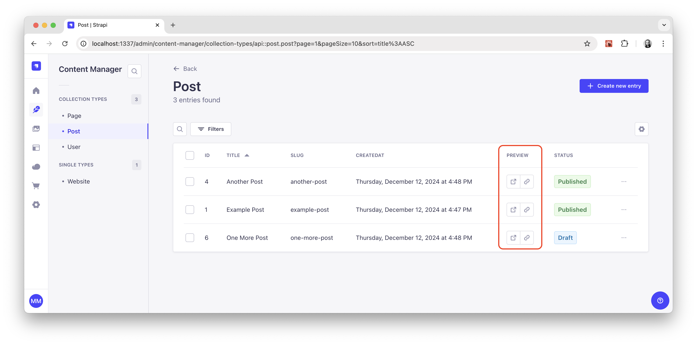

<div align="center">
  
  <h1>Strapi Preview Button</h1>
  <p>A plugin for Strapi CMS that adds a preview button and live view button to the content manager edit view.</p>
  
</div>

## Get Started

* [Features](#features)
* [Installation](#installation)
* [Configuration](#configuration)
* [Plugin Options](#plugin-options)
* [Extending](#extending)
* [User Guide](#user-guide)
* [Troubleshooting](#troubleshooting)
* [Migration](#migration)
* [Support or Donate](#donate)
* [Roadmap](#roadmap)

## <a id="features"></a>✨ Features
* Adds a new button in content manager sidebar which links the user to a preview or live view of a frontend app.
* Optional column in a collection's list view containing "preview" and "copy link" buttons.
* Optional button to copy the preview link to your clipboard.
* Customize which content types should use the preview button.
* Customize endpoints for draft and published URLs.
* Map values from an entry's data into preview URLs.
* Supports collection and single types.
* Supports localization with the `@strapi/plugin-i18n` plugin.

## <a id="installation"></a>💎 Installation
```bash
yarn add strapi-plugin-preview-button@latest
```

Don't forget to **restart or rebuild** your Strapi app when installing a new plugin.

## <a id="configuration"></a>🔧 Configuration
| property | type (default) | description |
| - | - | - |
| contentTypes | array (`[]`) | An array of objects describing which content types should use the preview button. |
| contentTypes[].uid | string | The `uid` value of either a single or collection type. |
| contentTypes[].draft | object (`{}`) | A configuration object to enable a draft preview button. |
| contentTypes[].published | object (`{}`) | A configuration object to enable a live view button. |

### `contentTypes`
An array of objects describing which content types should use the preview button.

Each object in the array requires the `uid` as well as `draft` and/or `published` props, which require a `url` prop at minimum.

| property | type (default) | description |
| - | - | - |
| url | string | The destination URL. See section about [mapping data into the URLs](#mapping-values-from-entry-data-into-preview-urls) for greater customization. |
| query | object (`{}`) | Optional query string params to include in the final URL. |
| openTarget | string (`StrapiPreview`) | Set to any custom string. Optionally set to `_blank` to always open the preview page in a new tab or window. Otherwise the preview will re-use the same preview tab or window. |
| copy | boolean (`true`) | Set to `false` to disable the copy link button that appears below the preview button. |
| alwaysVisible| boolean (`false`) | Set to `true` to enable both preview and live buttons to render together in a published state. This option only applies to the `draft` prop. |

#### Example
Consider we have a `Home` single type as well as `Page` and `Post` collection types, where each has a simple `title` and `content` field. The `Page` and `Post` models will also use a `uid` field named `slug` so they can create many entries with unique paths. Here is the minimum recommended config for this scenario.

```js
// ./config/plugins.js
'use strict';

module.exports = {
  'preview-button': {
    config: {
      contentTypes: [
        {
          uid: 'api::home.home',
          published: {
            url: 'http://localhost:3000',
          },
        },
        {
          uid: 'api::page.page',
          draft: {
            url: 'http://localhost:3000/api/preview',
            query: {
              type: 'page',
              slug: '{slug}',
            },
          },
          published: {
            url: 'http://localhost:3000/{slug}',
          },
        },
        {
          uid: 'api::post.post',
          draft: {
            url: 'http://localhost:3000/api/preview',
            query: {
              type: 'post',
              slug: '{slug}',
            },
          },
          published: {
            url: 'http://localhost:3000/blog/{slug}',
          },
        },
      ],
    },
  },
};
```

In this example, the `Home` page is a single type and does not have `draftAndPublish` enabled so we do not use the `draft` prop.

For `Pages` and `Posts`, the `slug` value from the entry data is dynamically populating into the `url` and `query` props. This allows you to populate *any* `number` or `string` property from the entry data into the preview URL by using curly braces around the property name.

This configuration will result in the following preview URLs for `Home`, `Pages`, and `Posts`.

```
// Draft URLs
http://localhost:3000/api/preview?slug=my-page&type=page
http://localhost:3000/api/preview?slug=my-post&type=post

// Published URLs
http://localhost:3000/
http://localhost:3000/my-page
http://localhost:3000/blog/my-post
```

> The `query` prop can actually take any params you want to pass to your frontend app.

#### Mapping values from entry data into preview URLs
By using `{curly_braces}`, you can map values from the entry data into your preview URLs to customize the URL however you like.

For example, depending on how you are choosing to handle your preview method, you could pass an `id` value to your **draft preview** but pass a `slug` value to your **live view**.

> **Unmatched values** will be replaced with an empty string.

```js
// ./config/plugins.js
{
  uid: 'api::page.page',
  draft: {
    url: 'http://localhost:3000/api/preview',
    query: {
      type: 'page',
      id: '{id}',
    },
  },
  published: {
    url: 'http://localhost:3000/{slug}',
  },
}
```

#### Use with localization enabled
If you have localization enabled for a content type, the `locale` value will be included in the entry data and replaced like the rest. You can simply use `{locale}` to include it where you like in the URL or query string.

```js
// ./config/plugins.js
{
  uid: 'api::page.page',
  draft: {
    url: 'http://localhost:3000/api/preview',
    query: {
      type: 'page',
      locale: '{locale}',
      slug: '{slug}',
    },
  },
  published: {
    url: 'http://localhost:3000/{locale}/{slug}',
  },
}
```

#### Use a secret key with preview URLs
You can optionally use a secret key with your preview URLs by taking advantage of environment vars and the `query` prop. See example below.

```js
// ./config/plugins.js
'use strict';

module.exports = ({ env }) => ({
  'preview-button': {
    config: {
      contentTypes: [
        {
          uid: 'api::page.page',
          draft: {
            url: 'http://localhost:3000/api/preview',
            query: {
              type: 'page',
              slug: '{slug}',
              secret: env('STRAPI_PREVIEW_SECRET'),
            },
          },
          published: {
            url: 'http://localhost:3000/{slug}',
          },
        },
      ],
    },
  },
});
```

This configuration will result in the following preview URLs for `Pages`.

```
// Draft URL
http://localhost:3000/api/preview?slug=my-page&type=page&secret=YOUR_SECRET_KEY

// Published URL
http://localhost:3000/my-page
```

Before granting access to the preview in your frontend app, you will want to compare and validate the secret key between both Strapi and frontend apps.

> It may be important to note that this plugin does not offer any validation or other handling for a secret key. The goal of including a secret key is simply to give your frontend app some way of "shaking hands" with your backend app to approve of the preview access.

#### Opening preview links in different tabs
By default this value is set to `StrapiPreview` but it can be any custom string. It is used in the `window.open` function for the preview button to always open in the same tab.

If you would rather have the preview button always open in a new tab, you could use `_blank` as the value. Special target keywords such as `_blank`, `_top`, `_self`, or `_parent` are also acceptable values.

```js
// ./config/plugins.js
{
  uid: 'api::page.page',
  draft: {
    url: 'http://localhost:3000/api/preview',
    query: {
      type: 'page',
      slug: '{slug}',
    },
    openTarget: '_blank',
  },
  published: {
    url: 'http://localhost:3000/{slug}',
    openTarget: '_blank',
  },
},
```

You could also use a different `openTarget` for each model schema if you wanted to have each collection type open in it's own designated tab or window, like in the example below.

```js
// ./config/plugins.js
'use strict';

module.exports = {
  'preview-button': {
    config: {
      contentTypes: [
        {
          uid: 'api::page.page',
          draft: {
            url: 'http://localhost:3000/api/preview',
            query: {
              type: 'page',
              slug: '{slug}',
            },
            openTarget: 'StrapiPreviewPage',
          },
          published: {
            url: 'http://localhost:3000/{slug}',
            openTarget: 'StrapiPage',
          },
        },
        {
          uid: 'api::post.post',
          draft: {
            url: 'http://localhost:3000/api/preview',
            query: {
              type: 'post',
              slug: '{slug}',
            },
            openTarget: 'StrapiPreviewPost',
          },
          published: {
            url: 'http://localhost:3000/blog/{slug}',
            openTarget: 'StrapiPost',
          },
        },
      ],
    },
  },
};
```

#### Disable copy link button
The "copy link" button located beneath the preview button can be disabled with the `copy: false` prop applied to `draft` and `published` configurations. This value is `true` by default.

```js
// ./config/plugins.js
{
  uid: 'api::home.home',
  published: {
    url: 'http://localhost:3000',
    copy: false,
  },
}
```

#### Always render preview and live buttons together
In **published mode**, the preview button changes to a "live view" button. If you want to keep the preview button alongside the live view button in published mode, set `draft.alwaysVisible` to `true`.

In **draft mode**, the live view buttons will not appear.

```js
// ./config/plugins.js
{
  uid: 'api::page.page',
  draft: {
    url: 'http://localhost:3000/api/preview',
    query: {
      type: 'page',
      slug: '{slug}',
    },
    openTarget: 'StrapiPreviewPage',
    alwaysVisible: true,
  },
  published: {
    url: 'http://localhost:3000/{slug}',
    openTarget: 'StrapiPage',
  },
}
```

## <a id="plugin-options"></a>🔌 Plugin Options
| property | type (default) | description |
| - | - | - |
| listViewColumn | boolean (`true`) | Set to `false` to disable the preview and copy link buttons from displaying in list view. |

### `listViewColumn`
Set to `false` to disable the preview and copy link buttons from displaying in list view.

```js
// ./src/api/page/content-types/page/schema.js
{
  "kind": "collectionType",
  "collectionName": "pages",
  "info": {
    "singularName": "page",
    "pluralName": "pages",
    "displayName": "Page",
    "description": ""
  },
  "options": {
    "draftAndPublish": true
  },
  "pluginOptions": {
    "preview-button": {
      "listViewColumn": false
    }
  },
  "attributes": {
    // etc.
  }
}
```

Ideally, the preview and copy link buttons in list view should appear alongside the other action icons for each row in the table. However, Strapi does not currently provide a hook to append new icons to that column. For now, this plugin will add its own "Preview" column with the extra icon actions.



## <a id="extending"></a>🔩 Extending
If you need to apply more advanced logic to the preview URL, you can accomplish this with the `plugin/preview-button/before-build-url` hook included with this plugin.

Your Strapi app will need a **custom plugin** in order to use this hook.

> See [Plugins Development](https://docs.strapi.io/developer-docs/latest/development/plugins-development.html) in Strapi docs for more info.

#### Example
In this example, we will create the bare minimum for a Strapi plugin that allows us to run our custom hook. The file structure for the plugin will look like the code below.

```
/src/plugins/example
  /admin
    /src
      index.js
  package.json
  strapi-admin.js
```

The `package.json` is required for a Strapi plugin.

```js
// ./package.json
{
  "name": "example",
  "version": "0.1.0",
  "description": "Example.",
  "strapi": {
    "displayName": "Example",
    "name": "example",
    "description": "Example",
    "kind": "plugin"
  },
  "dependencies": {}
}
```

```js
// ./strapi-admin.js
'use strict';

module.exports = require('./admin/src').default;
```

In the main plugin file below, we register the plugin in the `register` method and we register the hook with the `bootstrap` method.

The hook provides `draft` and `published` parameters which are the same as the UID configs from `config/plugins.js`. So if you are editing a `Page`, you will get the `draft` and `published` configs for `api::page.page` from your plugin config passed into the callback.

Here you will modify and return `draft` and `published` while using `data` however you like. In this example, we are just adding on a `foo=bar` query parameter to demonstrate how this hook can be utilized for more dynamic URLs.

```js
// ./admin/src/index.js
export default {
  register(app) {
    app.registerPlugin({
      id: 'example',
      name: 'example',
    });
  },

  bootstrap(app) {
    app.registerHook('plugin/preview-button/before-build-url', ({ data, draft, published }) => {
      const draftQuery = draft?.query ?? {};

      // Return an object with modified `draft` and `published` props using `data` however you like.
      return {
        draft: {
          ...draft,
          query: {
            ...draftQuery,
            foo: 'bar',
          },
        },
        published,
      };
    });
  },
};
```

Finally, don't forget to enable your plugin in your app by adding it to `config/plugins.js`.

```js
// ./config/plugins.js
'use strict';

module.exports = {
  example: {
    enabled: true,
    resolve: './src/plugins/example',
  },
};
```

## <a id="user-guide"></a>📘 User Guide

### How does this work with my frontend app?
The **Open live view** button will lead directly to the live page URL.

The **Open draft preview** button should lead to an endpoint that redirects to the appropriate preview page based on the query parameters passed to it.

For in-depth examples and instructions, please reference the links below to learn how this can be accomplished with Next.js and Strapi.

* [Next.js Preview Mode](https://nextjs.org/docs/advanced-features/preview-mode)
* [Next.js Preview Mode example with Strapi](https://github.com/vercel/next.js/tree/canary/examples/cms-strapi)

## <a id="troubleshooting"></a>💩 Troubleshooting

#### In general
Remember to **rebuild your app** after making changes to some config or other code.

```bash
yarn build
# OR
yarn develop
```

## <a id="migration"></a>🚌 Migration
Follow the [migration guides](MIGRATION.md) to keep your preview button plugin up-to-date.

## <a id="donate"></a>❤️ Support or Donate
If you are enjoying this plugin and feel extra appreciative, you can [buy me a beer or 3 🍺🍺🍺](https://www.buymeacoffee.com/mattmilburn).

## <a id="roadmap"></a>🚧 Roadmap
* Custom validation hook.
* RBAC support.
